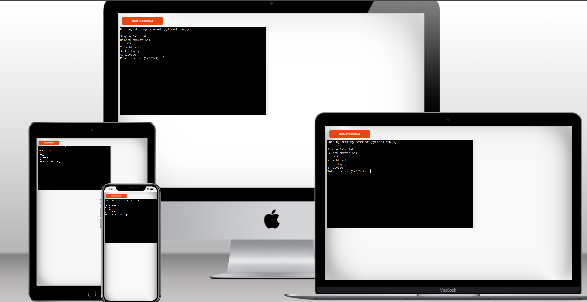
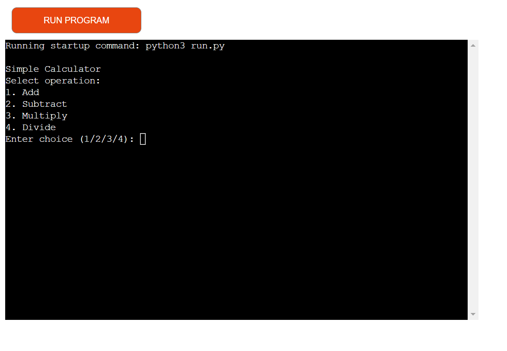
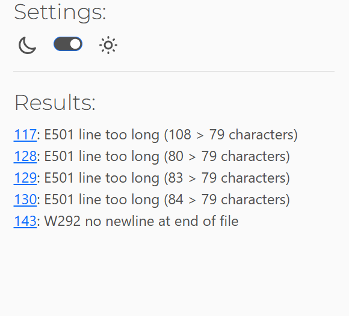
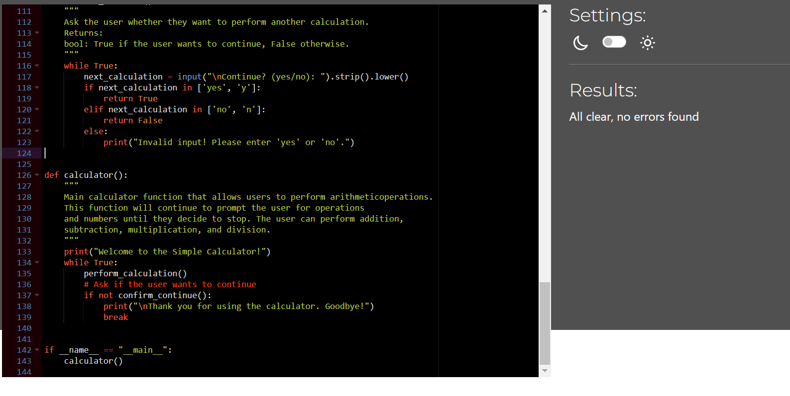

# Welcome to the Simple Calculator Website! 
This website allows users to perform basic arithmetic operations such as addition, subtraction, multiplication, and division.

View the live site here - <a href="https://simple-calculator-bj6j.onrender.com" target="_blank"> Simple Calculator </a>

# User Experience
The website Simple Calculator offers a straightforward and user-friendly experience. Here are some key aspects of the user experience:

Simplicity and Design: The interface is clean and minimalistic, making it easy for users to navigate and perform calculations without any distractions. The design focuses on functionality, ensuring that users can quickly access the calculator and start using it immediately.
Functionality: The calculator provides basic mathematical functions such as addition, subtraction, multiplication, and division. It performs these operations efficiently and displays results instantly, which is crucial for a smooth user experience.
Accessibility: The website is accessible on various devices, including desktops, tablets, and smartphones. This ensures that users can perform calculations on the go, enhancing the overall convenience.
Performance: The calculator operates smoothly without any noticeable lag or delays. This reliability is important for maintaining user trust and satisfaction.
User Feedback: The website could benefit from incorporating user feedback mechanisms, such as a rating system or a feedback form, to continuously improve the user experience based on real user input.
Overall, the Simple Calculator website excels in providing a no-frills, efficient tool for basic calculations, making it a valuable resource for users seeking quick and reliable mathematical operations.

# User Stories
User Story 1: Basic Calculation
As a student, I want to quickly perform basic arithmetic calculations so that I can check my homework answers efficiently.

User Story 2: Mobile Accessibility
As a professional on the go, I want to access the calculator on my smartphone so that I can perform quick calculations during meetings or while traveling.

User Story 3: User-Friendly Interface
As a senior citizen, I want to use a calculator with a simple and clear interface so that I can easily perform calculations without confusion.

User Story 4: Reliable Performance
As a small business owner, I want to use a reliable and fast calculator so that I can quickly calculate totals and percentages for my daily transactions.

User Story 5: Educational Tool
As a teacher, I want to recommend a simple online calculator to my students so that they can practice their math skills without getting distracted by complex features.

These user stories help in understanding the diverse needs of different users and ensuring the website meets those needs effectively.

# Features
Addition: Add two numbers. 
Subtraction: Subtract one number from another. 
Multiplication: Multiply two numbers. 
Division: Divide one number by another, with error handling for division by zero.

# Technologies used

python 
github 

# Testing

The test on https://pep8ci.herokuapp.com/# has resulted in some issues

Mostly long lines in comments but all were delt with by adjusting content

In earlier version of this product I tried to include a data libray called tkinter as import in top line of my code. But the deployment on render crashed throwing an error message says that "my Python does not understand tkinter". So, I removed the library. And after asking my mentor, tutors, my cohort facilitator and even some people on Slack, I was assured that as long it works then criteria are met. You can follow on the commit history on github.

# Manual Testing:
I try to enter nothing for a number   - doesnt accept - pass test
I try to divide by zero - doesnt accept - pass test

## Deployment

The deployment done on render.com and github

1. go to your account on render.com and press get started for free it will take you to the second page where you can see a New button in the navbar up , press it to have a dropdwn menue where you can choose web services.
2. you can see here a box that shows github button press it and add your github project URL then down the box will be another button with the word connect. press it to connect your github to render. The connect button will not be activated till you choose a project from within the box.
3. when you press connect you will be in the setting page. important is the following to be added:
    a. Build command: pip install -r requirements.txt && npm install
    b. Start command: node index.js
    c. environment variables: PORT; 8000 , 
                             PYTHON_VERSION; 3.10.7
4. finished setting then press deploy web service butoon down in the page it will take you to the last page where you see your deployed link.

   I used the CI template on github after I deleted procfile and runtime.text.

   ### Forking the GitHub Repository

By forking the GitHub Repository we make a copy of the original repository on our GitHub account to view and/or make changes without affecting the original repository by using the following steps...

1. Log in to GitHub and locate the GitHub Repository
2. At the top of the Repository (not top of page) just above the "Settings" Button on the menu, locate the "Fork" Button.
3. You should now have a copy of the original repository in your GitHub account.

## Credits: 

This project was inspired from code institute project Love Math which was written in Java. And I took it from there.

## Aknowledgement:

I am grateful to the support I got from my mentor, tutors,cohort facilitator and evryone who answered me on Slack. Thank you.
